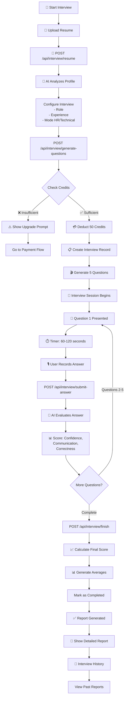
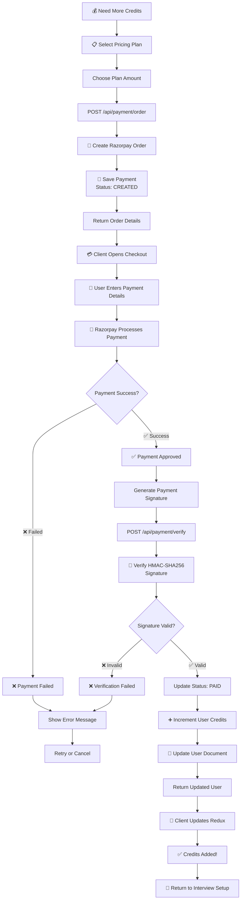
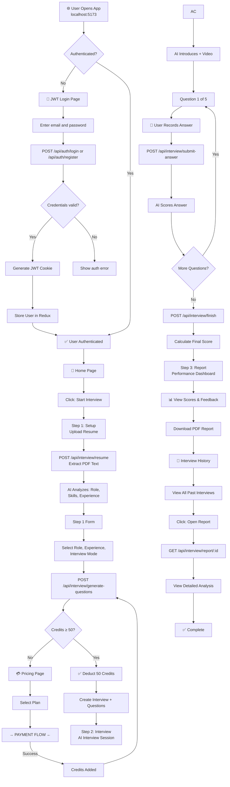

# InterviewIQ - Complete Flowchart Diagrams

This file contains all flowchart diagrams for the InterviewIQ project. You can copy each diagram and paste it into any Mermaid-compatible editor (GitHub, Notion, Draw.io, etc.).

---

## 1. Interview Lifecycle Flowchart

Copy the code below and paste into a Mermaid editor:

---

## 2. Payment & Credit Top-Up Flowchart

---

## 3. Complete End-to-End User Journey

---

## How to Use These Diagrams

### Option 1: View in GitHub
- Upload this file to your GitHub repo
- GitHub will automatically render the Mermaid diagrams

### Option 2: Use in Notion
- Copy the entire Mermaid code block
- Paste in Notion using `/mermaid` command

### Option 3: Use in Draw.io
- Visit [https://mermaid.live](https://mermaid.live)
- Paste the Mermaid code
- Export as PNG/SVG/PDF

### Option 4: Use in Documentation
- Copy individual diagram code
- Paste into your README.md or documentation site

---

## Diagram Summary

| Diagram | Purpose | Key Flows |
|---------|---------|-----------|
| **Interview Lifecycle** | Shows complete interview execution | Resume upload → AI analysis → Q&A → Scoring → Report |
| **Payment Flow** | Credit purchasing process | Plan selection → Razorpay → Verification → Credit update |
| **End-to-End Journey** | Complete user workflow | Login → Setup → Payment → Interview → History |

---

**Generated:** May 3, 2026  
**Project:** InterviewIQ  
**Format:** Mermaid Flowchart (JSON-compatible, open-source)
